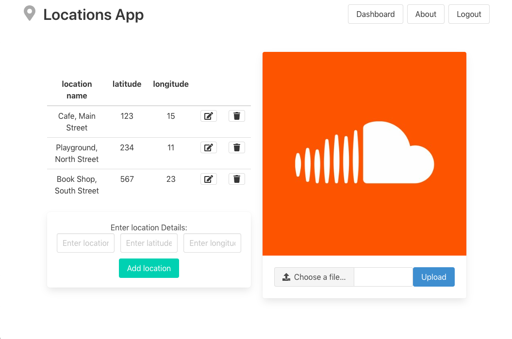

Locations
==========
### Release 1
Web app to make location lists.

---

Author: Pedro Royo  
SETU HDip Full Stack 1  
March 2025

---

### Credit
Code based on latest Playtime lab.

## Usage example:
Create user account, login.  
Add a name for a list of locations,  
enter the location name, latitude and longitude manually.  
Edit locations.  
Delete locations, and delete locations list.

## Features:
### App
Basic functionality:  
Enter, update, and delete data through a web interface.

### Added
When a list gets deleted, all the locations it contains are also deleted.

### Data Stores
Memory  
JSON file  
Mongo database

### Media
An image for each list of locations can be added, 
image uploads to Cloudinary service

### Other
Cookies.  
JSON Web Tokens used for authentication.  
Seeding of data (disabled for deployment)

### Screenshots

